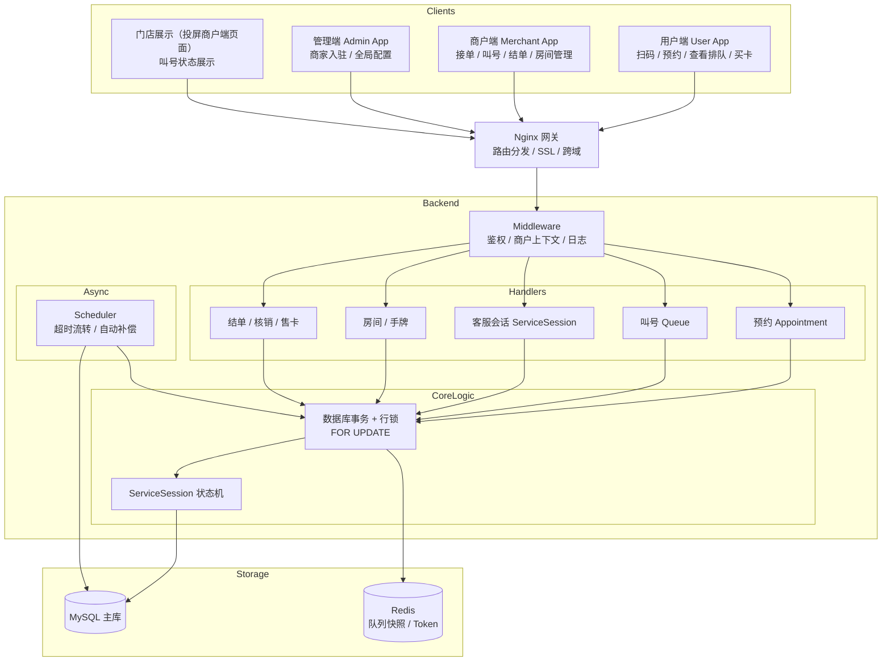
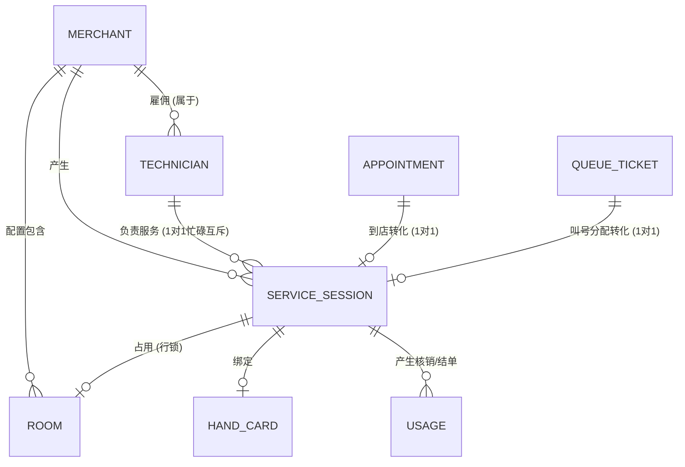

# 1. 概览与系统架构设计

## 1.1 项目简介
**Kabao** 是一个面向现代服务业的综合商户服务系统，旨在解决多模式、多场景下的到店服务流转问题。系统支持从**预约**、**排队叫号**、**到店服务**、**房间/手牌分配**，再到**预结单**与**核销/售卡**的全链路业务闭环。

针对不同商户的经营习惯，Kabao 提供了高度可配置的**多功能开关**能力。需要特别说明：在当前代码实现下，商户的**客服模式（`support_customer_service_mode`）**与**叫号模式（`support_queue` + `queue_mode`）在运行时互斥**——当开启客服模式时，系统不会进入叫号链路；当启用叫号链路时，要求未开启客服模式。房间管理、手牌管理、项目与售卡等能力可按需独立开启。

## 1.2 架构原则
本项目后端严格遵循“**受控重构与高内聚低耦合**”的架构演进原则。模块划分明确，禁止越界调用：

*   **`handlers/`**：仅负责 HTTP 请求参数解析、鉴权、事务边界组织以及响应组装。复杂业务逻辑必须抽离。
*   **`models/`**：封装数据结构映射、数据库表字段操作以及**与数据一致性强相关的状态机归一化逻辑**。
*   **`scheduler/`**：集中处理后台自动推进、超时检测与自动补偿等异步任务。强制要求具备**幂等性**与防全表扫描控制。
*   **`queue/`**：封装底层队列存储操作逻辑。
*   **`middleware/`**：负责认证、鉴权、跨域与请求链路追踪。
*   **`config/`**：负责全局环境、配置和依赖（如 DB）生命周期管理。

## 1.3 核心技术栈
*   **后端**：Go + Gin (或原生 HTTP 配合路由) + GORM
*   **数据库**：MySQL (核心状态机与行锁并发控制)
*   **前端**：Vue 3 + Vite (划分为 User 用户端、Merchant 商户端、Admin 平台管理端)
*   **部署**：Nginx 反向代理 + Shell 自动化脚本部署

---

## 2. 核心系统架构设计

### 2.1 整体架构图
以下架构图展示了 Kabao 系统的多端交互、后端服务模块以及核心存储层之间的调用关系。

### 2.2 核心数据与状态总线设计

在 Kabao 系统中，解决多入口（预约/叫号/客服等）接入下的“**平行状态机冲突**”的核心方案，是引入了 **`ServiceSession`（服务会话）作为全系统唯一的状态机总线**。同时需要注意：在商户维度的运行时配置上，**客服模式与叫号模式互斥**（开启客服模式时不走叫号链路）。

不论流量入口是来自**预约单转化**、**商户端叫号分配**，还是**用户直接扫技师二维码**，一旦服务开始，必须收敛到 `ServiceSession` 模型中进行状态生命周期管理（`pending` -> `serving` -> `auto_finishing` -> `finished`）。

#### 核心外围实体关联拓扑

*   **ServiceSession (会话引擎)**：所有业务最终的服务载体。状态机流转不可逆且具备幂等性校验。
*   **Technician (技师)**：考勤 (`busy/free`) 状态的计算源头。同一技师不可同时存在多个处于 `serving` 或 `auto_finishing` 状态的 Session。
*   **Room & HandCard (物理资源)**：在 Session 处于活跃状态时被独占锁定，通过数据库级别的 `FOR UPDATE` 行锁防止高并发下的超售与资源重分。
*   **QueueTicket & Appointment (前置漏斗)**：在用户未正式进入服务（`serving`）前，在排队漏斗中流转。它们是 `ServiceSession` 的前置状态投射。
