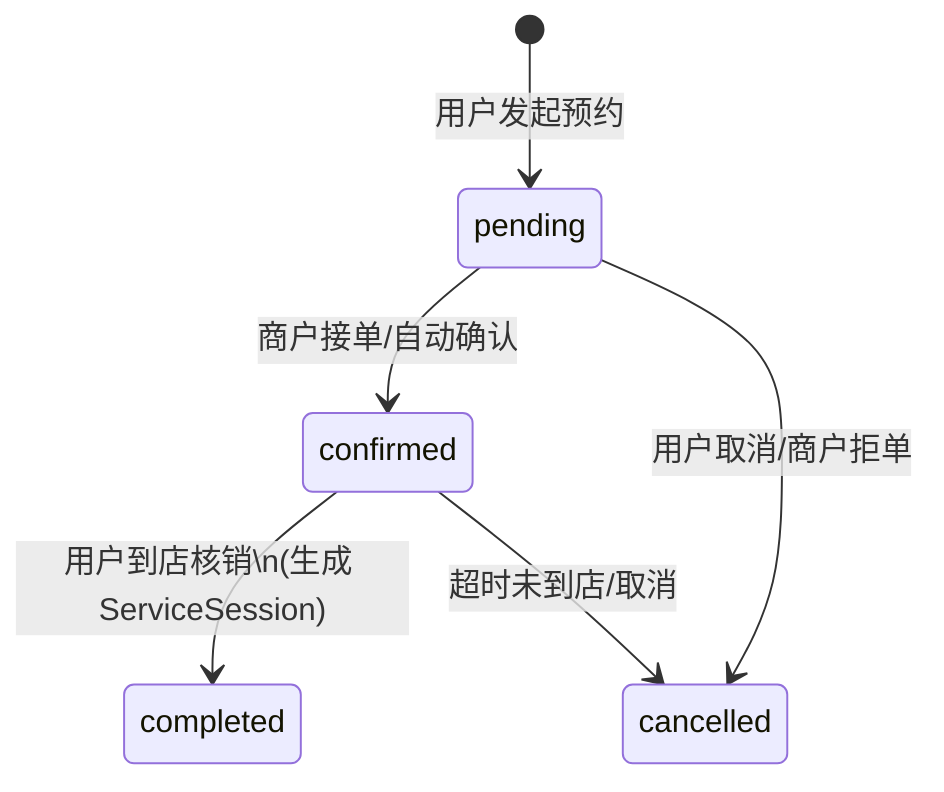
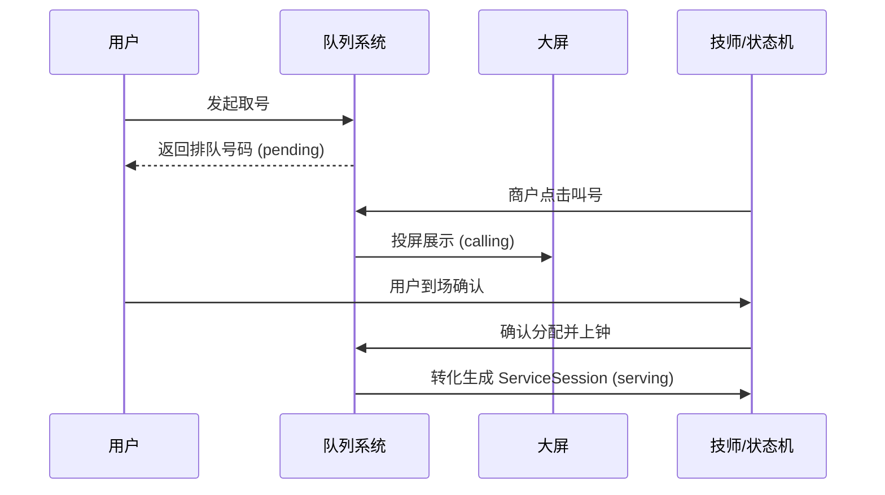

# 2. 核心业务流程与服务设计

本章节详细介绍 Kabao 系统的 9 大核心功能分支。每个分支都有其独立的流转路径，但最终都会收敛到核心状态机或底层数据模型中。

## 2.1 预约流程 (Appointment)

**业务介绍**：允许用户在小程序端选择商户、服务项目、技师及空闲时间段进行提前预约。商户端可进行接单确认，用户到店后核销预约单，并正式转化为在店服务状态。

**核心调用链与机制**：
1. **时间槽查询**：用户拉取指定技师的空闲时间片，系统需聚合已存在的预约单、当前真实会话状态综合计算出可用时间槽。
2. **防并发锁定**：用户提交预约时，系统进行事务级校验，防止同一技师同一时间段被超卖并发预定。
3. **状态流转**：`pending` (待确认) -> `confirmed` (已确认) -> `completed` (已到店/核销) 或 `cancelled` (已取消/超时)。
4. **到店转化**：用户到店核销后，预约单结束，系统创建一条 `ServiceSession` 并进入门店排队或直接服务状态。

## 2.2 项目服务管理 (Project Management)

**业务介绍**：管理商户提供的服务项目（如按摩、采耳等）。项目不仅包含基础的名称、价格，还关联了所需时长，影响了后续会话(`ServiceSession`)的自动结单计算时间。

**核心调用链与机制**：
- 在 `project.go` 中处理项目的 CRUD。
- 商户可针对项目设置售卡/次卡策略。
- 当生成 `Usage`（核销明细）时，强依赖项目的配置信息。

## 2.3 客服模式 (Customer Service Mode)

**业务介绍**：最简化的服务流转模式。在当前代码实现下，该模式要求商户开启 `support_customer_service_mode`，并且与叫号模式运行时互斥（开启客服模式时不进入叫号链路）。

**核心调用链与机制**：
1. **扫码验权**：校验用户 Session，解析技师 ID。
2. **互斥校验**：系统查询该技师是否存在 `status IN ('serving', 'auto_finishing')` 的活跃会话。
3. **直接建单**：若技师空闲，直接创建并初始化状态为 `serving` 的 `ServiceSession`，自动打卡上钟。

## 2.4 叫号模式 (Queue Mode)

**业务介绍**：传统的门店排队模式。包含外部线上取号和门店内部取号。引入大屏叫号概念。该模式生效前提为：商户开启 `support_queue` 且 `queue_mode` 为 `auto` 或 `manual`，并且未开启 `support_customer_service_mode`。

**核心调用链与机制**：
1. **取号入池**：生成 `QueueTicket`，状态为 `pending`。
2. **大屏叫号**：商户端点击“叫号”，票据状态变为 `calling`。
3. **分配上钟**：叫号成功并分配空闲技师后，系统执行核心转化，结束 Ticket 生命周期，并开启 `ServiceSession` (`serving`)。
4. **过号处理**：叫号超时无响应，状态变为 `passed`，需商户端人工介入（延后处理或作废）。

## 2.5 结单与核销流程 (Settlement & Usage)

**业务介绍**：订单的服务核销与结算。系统支持在服务中途添加新项目（多次核销），并支持商户端手动的预结单确认与撤销动作。

**核心调用链与机制**：
- `usage.go`：处理服务项目的扣减（从卡内扣次/余额）。记录每一笔核销明细。
- **预结单机制**：系统通过 `ServiceSession` 进入 `auto_finishing` 时，会生成待支付/待确认的汇总单据。
- `usage_revoke.go`：提供安全的“反结单/撤销”操作，退回卡次数，并可逆转部分 `Session` 状态供重新修改。

## 2.6 房间管理分支 (Room Management)

**业务介绍**：物理房间的调度与锁定。开启该功能的商户，每次分配技师时必须强制绑定一个空闲房间。

**核心调用链与机制**：
1. **房间状态**：`available` (空闲) -> `occupied` (占用中) -> `cleaning` (打扫中)。
2. **抢占锁**：在分配房间时，系统对该房间记录使用 `FOR UPDATE` 行锁，确保高并发分配时同一房间不会被分配给两个会话。
3. **生命周期绑定**：房间的 `occupied` 状态与 `ServiceSession` 强绑定；Session 结束时，释放房间进入 `cleaning`。

## 2.7 手牌管理分支 (Hand Card Management)

**业务介绍**：洗浴/足疗等业态特有的实体手牌绑定。发牌后，用户的后续一切项目消费及结单动作均可基于该手牌 ID 追踪。

**核心调用链与机制**：
- 手牌作为用户在店内的临时唯一标识，状态包括空闲、使用中。
- 与房间锁机制类似，发牌时需事务级锁定。
- 最终结单收银时回收手牌，释放状态。

## 2.8 直购售卡系统 (Direct Card Sales)

**业务介绍**：系统的储值卡/次卡售卖中心。支持微信支付购卡，系统通过 `card.go` 将卡片资产发放到用户账户。

**核心调用链与机制**：
- 售卡项目 (`CardProject`) 定义包含的内容（如包含10次足疗）。
- 支付成功回调后，在事务内创建用户卡包资产 (`UserCard`)，并记录初始明细日志。

## 2.9 技师与考勤系统 (Technician & Attendance)

**业务介绍**：管理技师账户（格式如 `js0001`）与考勤状态。技师忙闲状态并非直接修改字段，而是根据是否有活跃会话推导或考勤策略计算得出。

**核心调用链与机制**：
- **考勤策略**：支持常规排班制与自由临时工制。通过 `attendance_policy.go` 计算当前是否属于可接单时段。
- **忙闲推导**：`busy` / `free`。系统在分配任务前，不仅检查静态考勤，还必须关联查询是否存在活跃的 `ServiceSession`。
