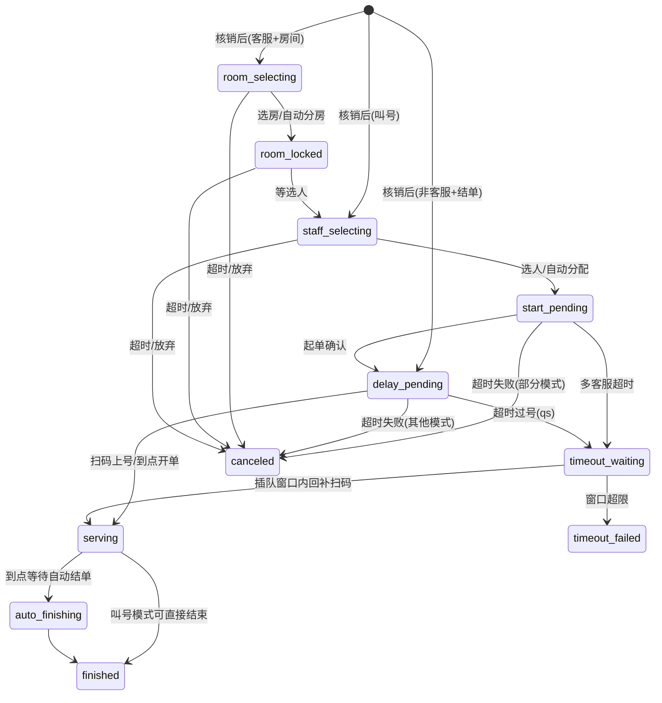
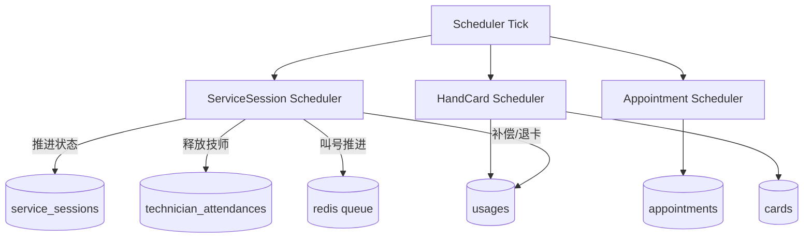

# Kabao Repo Wiki（基于当前代码，2026-03-05）

## 1. 仓库与服务总览

### 1.1 代码结构
- 后端：`backend/`（Gin + GORM + MySQL + Redis 队列）
- 前端：`frontend/`（Vue3 + Vite，多端路由复用）
- 文档：`docs/wiki/`、`docs/plans/`

### 1.2 运行形态
- 单进程入口：`backend/main.go`（HTTPS `:8080`，同时挂 User/Merchant/Admin 全路由）
- 拆分入口：
  - `backend/cmd/user_service/main.go`（`:8081`）
  - `backend/cmd/merchant_service/main.go`（`:8082`）
  - `backend/cmd/admin_service/main.go`（`:8083`）
- 三类调度器在服务启动时拉起：
  - `service_session_scheduler`
  - `appointment_scheduler`
  - `hand_card_scheduler`

### 1.3 三端接口面
- User：`/user/*`
- Merchant：`/merchant/*`
- Admin：`/admin/*`

```mermaid
flowchart LR
  U[User Frontend] --> UG[/user/*]
  M[Merchant Frontend] --> MG[/merchant/*]
  A[Admin Frontend] --> AG[/admin/*]

  UG --> H[Handlers]
  MG --> H
  AG --> H

  H --> DB[(MySQL)]
  H --> Q[(Redis Queue)]
  S1[ServiceSession Scheduler] --> DB
  S1 --> Q
  S2[Appointment Scheduler] --> DB
  S3[HandCard Scheduler] --> DB
```

## 2. 核心领域模型与状态

### 2.1 核心实体
- `ServiceSession`：服务会话主状态机
- `Usage`：核销记录（`in_progress/success/failed`）
- `Appointment`：预约（`pending/confirmed/finished/canceled/failed`）
- `TechnicianAttendance`：出勤与可服务状态（`idle/busy/paused/rest`）
- `Card`：卡资产（含锁卡字段）

### 2.2 ServiceSession 状态机（含模式前缀）
状态主体：
- `created`
- `room_selecting`
- `room_locked`
- `staff_selecting`
- `start_pending`
- `delay_pending`
- `serving`
- `auto_finishing`
- `timeout_waiting`
- `timeout_failed`
- `finished`
- `canceled`

模式前缀：`cs_ / qs_ / qm_ / qms_ / qmm_`



## 3. 全服务功能分支流程

### 3.1 用户链路
- 登录/注册/绑手机
- 卡列表、卡详情、项目列表、核销码生成
- 会话恢复、选房、选客服、加钟
- 预约创建/取消/查询
- 直购下单/确认

### 3.2 商户链路
- 商户配置：服务开关、营业状态、商户信息
- 项目、房间、技师、岗位、权限微调
- 核销/扫码上号/结单触发叫号
- 看板（房间、工作人员）
- 叫号控制（暂停、继续、强制继续、自动分配）
- 手牌绑定/归还/解锁卡
- 直购模板与收款配置

### 3.3 平台管理链路
- 岗位与权限枚举管理
- 角色权限模板配置
- 平台系统配置
- 平台创建/更新商户

## 4. 调度与状态流转分析

### 4.1 `service_session_scheduler`（3s）
主逻辑：
- 手动叫号长时间 serving 自动收尾（>4h）
- 打烊后批量收尾 in_progress usage（15min）
- 回填 `serving` 但 `start_confirmed_at` 缺失异常
- 扫描会话状态并推进：
  - 选房/选人超时
  - start_pending 超时分支
  - delay_pending 超时分支
  - serving 到点进入自动结单或直接完成
  - timeout_waiting 号码窗口与时间窗口联合判定

### 4.2 `appointment_scheduler`（15s）
- 处理创建超过 10 分钟且未指定技师的 `pending` 预约
- 自动挑选可服务技师（排除运营岗）
- 失败则置 `failed` 并写 `failed_reason`

### 4.3 `hand_card_scheduler`（5s）
- 对开启 `support_hand_card` 的商户生效
- 首次发牌后超 8 分钟未归还，自动锁卡
- 锁卡原因写入未归还手牌号清单



## 5. 功能正常化评估（当前仓库）

### 5.1 可运行性与测试
- 后端单测：`go test ./...` 通过（`handlers/models/scheduler` 通过）
- 前端构建：`npm run build` 失败（当前环境 `NODE_ENV` 与 `crypto.getRandomValues` 兼容问题）

### 5.2 分支完整性评估
- `service_session + queue + attendance`：高复杂度、可运行，但并发与权限边界依赖较多隐式约束
- `appointment`：功能闭环存在，但鉴权边界与角色分支存在缺陷
- `hand_card`：链路清晰，依赖调度补偿，需加强并发场景回归
- `direct_sale/shop`：主链路完整
- `admin/rbac`：能力完整，但认证密钥治理不足

结论：
- 业务流“可跑”，但“安全边界和租户隔离”未达到生产稳态要求。

## 6. 关键流程 Code Review（漏洞/缺陷）

> 分级：P0（立即修）、P1（本周修）、P2（迭代修）

### P0-1 认证可伪造（用户 token 无签名校验）
- 位置：`backend/middleware/auth.go` 第 28-55 行，`backend/handlers/user.go` 第 302-306 行
- 问题：`user_{id}_{ts}` 纯格式 token 可被任意构造，只校验用户存在即放行。
- 风险：任意用户身份冒用，所有用户侧接口可被横向访问。

### P0-2 JWT/HMAC 统一硬编码密钥
- 位置：
  - `backend/middleware/auth.go` 第 58-63 行
  - `backend/handlers/merchant.go` 第 145 行
  - `backend/handlers/technician_login.go` 第 78 行
  - `backend/handlers/user.go` 第 135 行
- 问题：`"your-secret-key"` 硬编码且多用途复用。
- 风险：源码泄露即全链路 token 与 user code 可伪造。

### P0-3 用户侧严重越权读取（卡/核销/预约）
- 位置：
  - `backend/routes/routes.go` 第 43-49、62-64 行（受保护路由但使用 path id）
  - `backend/handlers/card.go` 第 73-76、79-102 行
  - `backend/handlers/usage.go` 第 17-25 行
  - `backend/handlers/appointment.go` 第 184-189、191-207 行
- 问题：多个用户接口未校验 `c.Get("user_id")` 与目标资源归属一致。
- 风险：任意登录用户可读他人卡片、核销记录、预约信息。

### P0-4 预约创建存在“替他人下单”入口
- 位置：`backend/handlers/appointment.go` 第 269-273、297-300 行
- 问题：`CreateAppointment` 以请求体 `user_id` 为准，未强制等于登录态用户 ID。
- 风险：越权为他人创建预约，数据污染与风控绕过。

### P1-1 技师权限分支失效（字符串不一致）
- 位置：`backend/handlers/appointment.go` 第 138-141 行
- 问题：判断 `auth_type == "technician"`，而中间件写入的是 `"staff"`。
- 风险：技师端本应仅看“分配给自己”的预约，但过滤逻辑失效。

### P1-2 商户侧租户边界不收敛（依赖 path merchant_id）
- 位置：
  - 路由开放：`backend/routes/routes.go` 第 108-111、120、137、146 行
  - 读取实现：`backend/handlers/usage.go` 第 41-52 行，`backend/handlers/appointment.go` 第 127-133 行
- 问题：多个商户接口以路径 merchant_id 作为查询条件，未统一强制等于 token 内 merchant_id。
- 风险：在 RBAC 配置不严/角色可访问时，可能产生跨商户数据读取面。

### P2-1 内部队列快照接口默认可匿名访问
- 位置：
  - 路由：`backend/routes/routes.go` 第 83-84 行
  - 处理：`backend/handlers/internal_queue.go` 第 24-32 行
- 问题：仅在配置 `KABAO_INTERNAL_TOKEN` 时鉴权；未配置时完全公开。
- 风险：队列快照泄露（号码、叫号状态）。

## 7. 修复计划（建议执行顺序）

### 阶段 A（24 小时内，安全止血）
1. 禁用 legacy `user_*` token 分支，用户端改 JWT 强校验 `exp/iss/aud`。
2. 引入 `KABAO_JWT_SECRET`、`KABAO_USER_CODE_SECRET`，删除硬编码密钥；完成密钥轮换。
3. 对用户端资源统一加归属校验：`card.user_id == current_user_id`、`appointment.user_id == current_user_id`。
4. `CreateAppointment` 去掉请求体 `user_id`，强制使用登录态 user_id。

### 阶段 B（3-5 天，租户边界收敛）
1. 商户侧所有 `:id` 路由增加 `ensureMerchantScope()`：默认仅允许 `id == token.merchant_id`。
2. `GetMerchantAppointments` 中 `auth_type` 判断修复为 `staff`，并补测试覆盖。
3. `InternalGetOnsiteQueueSnapshot` 默认必须鉴权（生产环境强制 token）。

### 阶段 C（1-2 周，稳定性与回归）
1. 增加安全回归测试：
   - 用户 IDOR
   - 商户跨租户读取
   - staff/merchant 权限矩阵
2. 对 `service_session`、`queue_status` 增加并发事务测试（双扫码、并行分配、超时回补）。
3. 前端构建环境修复：Node 版本与 Vite 环境变量规范化，纳入 CI。

## 8. 建议的 Wiki 持续维护方式
- 每次改动 `service_session` 状态或调度规则，必须同步更新本文件的状态图与调度章节。
- 每次新增接口，必须标注：鉴权方式、租户边界、状态影响。
- 将本文件纳入 PR 检查项（模板中增加“是否影响状态机/权限边界”）。

