# Kabao Repo Wiki（c9ba864f，2026-03-05）

基于 commit `c9ba864f`（2026-03-05）全量代码审阅生成。涵盖仓库结构、核心模型、9 大功能分支流程、调度器分析、认证权限体系、功能正常化评估、Code Review 漏洞清单及修复实施方案。

---

## 1. 仓库与服务总览

### 1.1 代码结构与目录

```
kabao/
├── backend/
│   ├── main.go                    # 单体入口（HTTPS :8080）
│   ├── cmd/
│   │   ├── user_service/          # 拆分入口 :8081
│   │   ├── merchant_service/      # 拆分入口 :8082
│   │   └── admin_service/         # 拆分入口 :8083
│   ├── config/
│   │   ├── database.go            # DB 初始化、内联 DDL 迁移、种子数据
│   │   └── env.go                 # .env 加载
│   ├── handlers/                  # 32 个 handler 文件
│   ├── models/                    # 18 个 model 文件
│   ├── scheduler/
│   │   ├── service_session_scheduler.go
│   │   ├── appointment_scheduler.go
│   │   └── hand_card_scheduler.go
│   ├── queue/
│   │   ├── queue.go               # Store 接口定义
│   │   └── redis_store.go         # Redis + Lua 实现
│   ├── middleware/
│   │   ├── auth.go                # 认证（legacy user token + JWT）
│   │   └── rbac.go                # 角色权限校验
│   └── routes/
│       └── routes.go              # 全路由注册
├── frontend/                      # Vue3 + Vite（多端路由复用）
├── docs/
│   ├── wiki/                      # Wiki 文档
│   └── plans/                     # 计划文档
└── deploy-*.sh                    # 部署脚本
```

### 1.2 运行形态

| 入口 | 端口 | 路由 | 调度器 |
|---|---|---|---|
| `backend/main.go` | `:8080` HTTPS | User + Merchant + Admin | 全部 3 个 |
| `cmd/user_service` | `:8081` | User | session + appointment |
| `cmd/merchant_service` | `:8082` | Merchant | session + appointment |
| `cmd/admin_service` | `:8083` | Admin | 无 |

三个调度器在服务启动时以 goroutine 拉起，无优雅停机控制。

### 1.3 三端接口面

- **User**（`/user/*`）：登录注册、卡片、核销码、会话恢复、选房选人、预约、直购
- **Merchant**（`/merchant/*`）：配置、项目、房间、技师、岗位、权限、核销、叫号、看板、手牌、售卡
- **Admin**（`/admin/*`）：岗位 CRUD、权限枚举、角色权限模板、系统配置、商户管理

### 1.4 系统拓扑

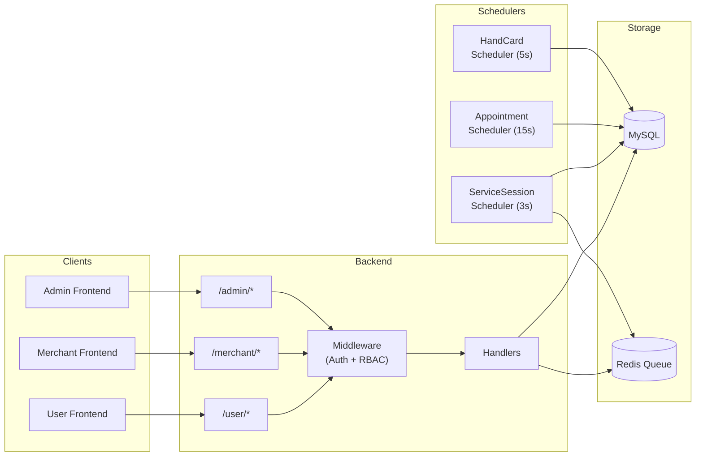

---

## 2. 核心领域模型

### 2.1 实体关系

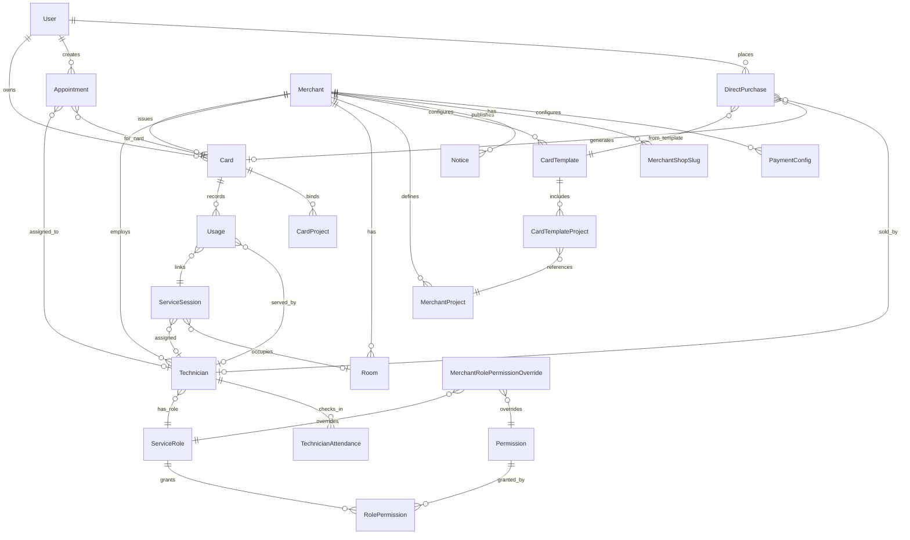

### 2.2 ServiceSession 状态机

**核心状态**（12 个）：

| 状态 | 含义 |
|---|---|
| `created` | 会话已创建 |
| `room_selecting` | 等待用户选房 |
| `room_locked` | 房间已锁定，等待选人 |
| `staff_selecting` | 等待选择/分配客服 |
| `start_pending` | 客服已分配，等待扫码起单 |
| `delay_pending` | 核销后延迟等待（OC 模式/叫号扫码上号） |
| `serving` | 服务进行中 |
| `auto_finishing` | 到点自动结单等待期 |
| `timeout_waiting` | 过号等待（叫号模式） |
| `timeout_failed` | 过号超限失败 |
| `finished` | 服务完成 |
| `canceled` | 已取消 |

**完整状态流转图**：

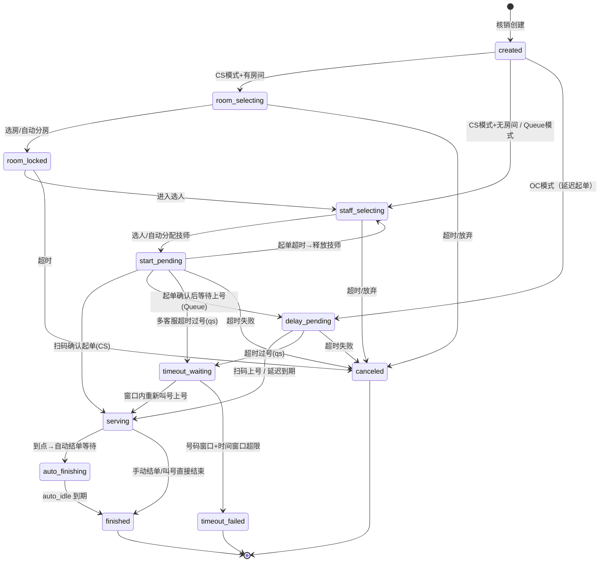

### 2.3 Session 模式枚举与推导

**7 种模式**（`models/session_mode.go`）：

| 模式 | 常量 | 前缀 | 触发条件 |
|---|---|---|---|
| 客服模式 | `cs` | `cs_` | `SupportCustomerServiceMode = true` |
| 自动单窗叫号 | `qs` | `qs_` | `SupportQueue + QueueMode=auto + !Multi` |
| 自动多窗叫号 | `qm` | `qm_` | `SupportQueue + QueueMode=auto + Multi` |
| 手动单窗叫号 | `qms` | `qms_` | `SupportQueue + QueueMode=manual + !Multi` |
| 手动多窗叫号 | `qmm` | `qmm_` | `SupportQueue + QueueMode=manual + Multi` |
| 结单模式 | `oc` | 无前缀 | `SupportOrderComplete` 且无客服/叫号 |
| 简单模式 | `simple` | 无前缀 | 无高级特性 |

**推导逻辑**（`ResolveSessionMode`）：
1. `SupportCustomerServiceMode` → `cs`
2. `SupportQueue` → 按 `QueueMode` × `Multi` 分 4 种
3. `SupportOrderComplete` → `oc`
4. 兜底 → `simple`

### 2.4 状态前缀兼容体系

`models/status_compat.go` 提供状态前缀工具函数：

- `NormalizeSessionStatus("cs_serving")` → `"serving"`
- `ApplyStatusPrefix("cs_start_pending", "serving")` → `"cs_serving"`
- `ExpandStatusesWithKnownPrefixes(["serving"])` → `["serving", "cs_serving", "qs_serving", "qm_serving", "qms_serving", "qmm_serving"]`

所有数据库查询使用 `ExpandStatusesWithKnownPrefixes` 兼容带/不带前缀的历史数据。

### 2.5 TechnicianAttendance 状态

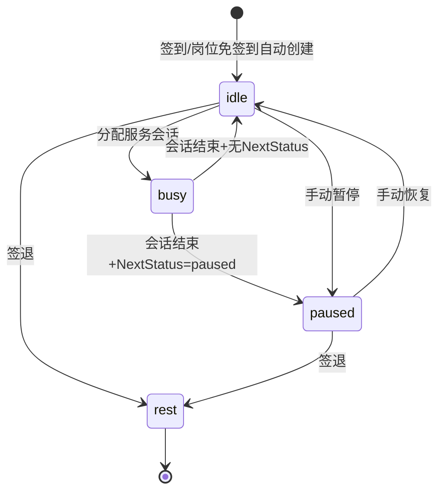

### 2.6 Appointment 状态

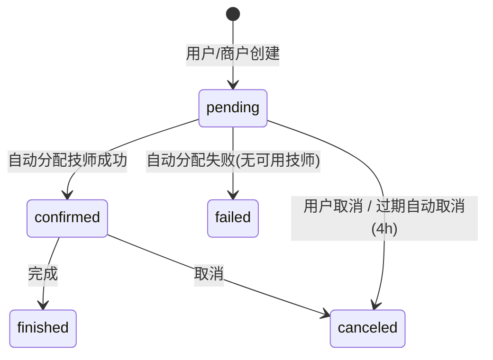

### 2.7 Usage 状态

| 状态 | 含义 |
|---|---|
| `in_progress` | 核销进行中（关联 session 未完成） |
| `success` | 完成 |
| `failed` | 失败（撤销等） |

### 2.8 Card 锁卡

| 字段 | 用途 |
|---|---|
| `locked` | 是否锁定 |
| `locked_reason` | 锁定原因（含未归还手牌号） |
| `locked_at` / `locked_by` | 锁定时间/操作人 |
| `unlocked_at` / `unlocked_by` / `unlocked_reason` | 解锁信息 |

触发锁卡：`hand_card_scheduler` 检测手牌超时未归还。
触发解锁：手牌全部归还 / 商户手动解锁（需 `merchant.card.unlock` 权限）。

---

## 3. 全功能分支流程

### 3.1 预约流程 (Appointment)

**入口**：
- 用户侧：`POST /user/appointments`（`CreateAppointment`）
- 商户侧：`GET /merchant/:id/appointments`（`GetMerchantAppointments`）
- 取消：`PUT /user/appointments/:id/cancel`（`CancelAppointment`）

**流程图**：

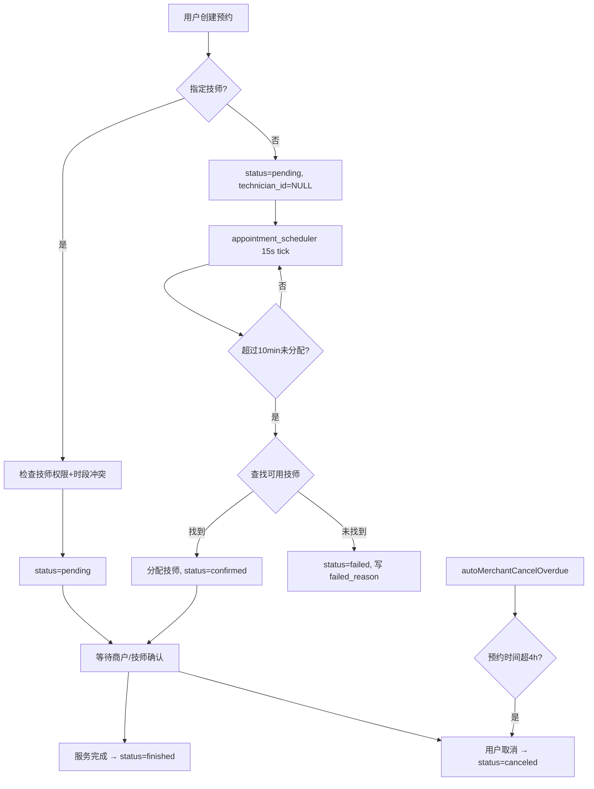

**核心代码路径**：
- `handlers/appointment.go`：创建、取消、查询、过期清理
- `scheduler/appointment_scheduler.go`：自动分配技师

### 3.2 项目服务管理 (Project)

**实体**：`MerchantProject`（商户项目）、`CardProject`（卡绑定项目）、`CardTemplateProject`（模板关联项目）

**接口**：
- `GET/POST/PUT/DELETE /merchant/projects`：项目 CRUD
- 核销时通过 `project_id` 关联到 Usage 和 ServiceSession → 确定服务时长 `duration_minutes`

### 3.3 客服模式 (CS Mode)

**触发条件**：`Merchant.SupportCustomerServiceMode = true`

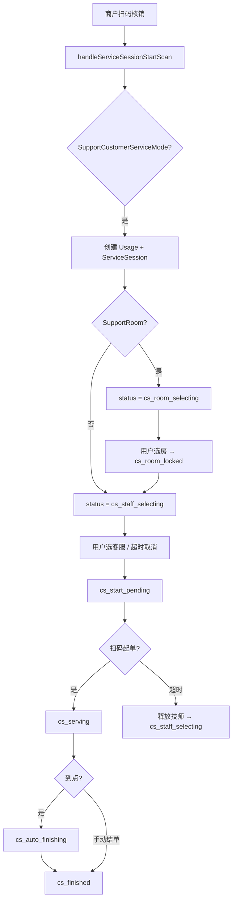

**关键实现**：
- `handlers/service_session.go`：`handleServiceSessionStartScan`（CS 链路入口）
- `ChooseServiceSessionTechnician`：含 busy 二次校验（防同一技师双会话）
- `assignRoomIfPossible`：自动分配空闲房间

### 3.4 叫号模式 (Queue Mode)

**触发条件**：`Merchant.SupportQueue = true` 且 `!SupportCustomerServiceMode`

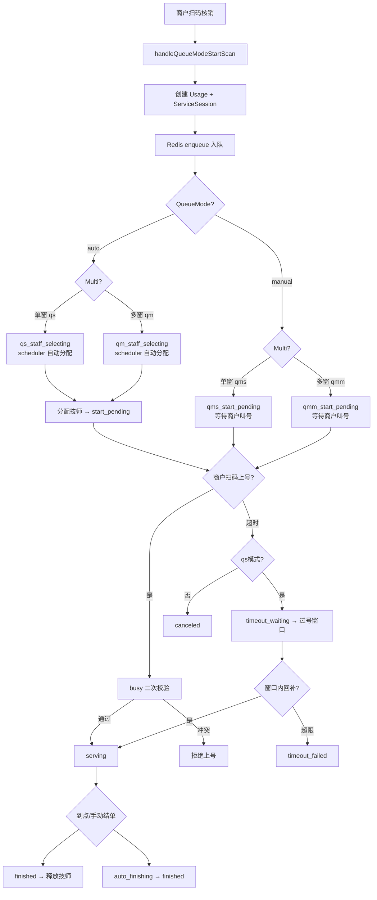

**叫号控制接口**（`handlers/queue_status.go`）：
- `GET /merchant/queue/calling-status`：当前叫号状态
- `POST /merchant/queue/pause`：暂停叫号
- `POST /merchant/queue/resume`：继续叫号
- `POST /merchant/queue/force-continue`：强制继续
- `GET /merchant/queue/pending`：排队列表
- `GET /merchant/queue/timeout-waiting`：过号等待列表

**过号机制**（`models/session_mode.go`）：
- `QsTimeoutWindowEndNo(myNo, timeoutCount)` → `myNo + 3`：过号后保留 3 个号的窗口
- 窗口内可被重新叫号上号；超出窗口 → `timeout_failed`

### 3.5 结单与核销流程

**核销链路**：

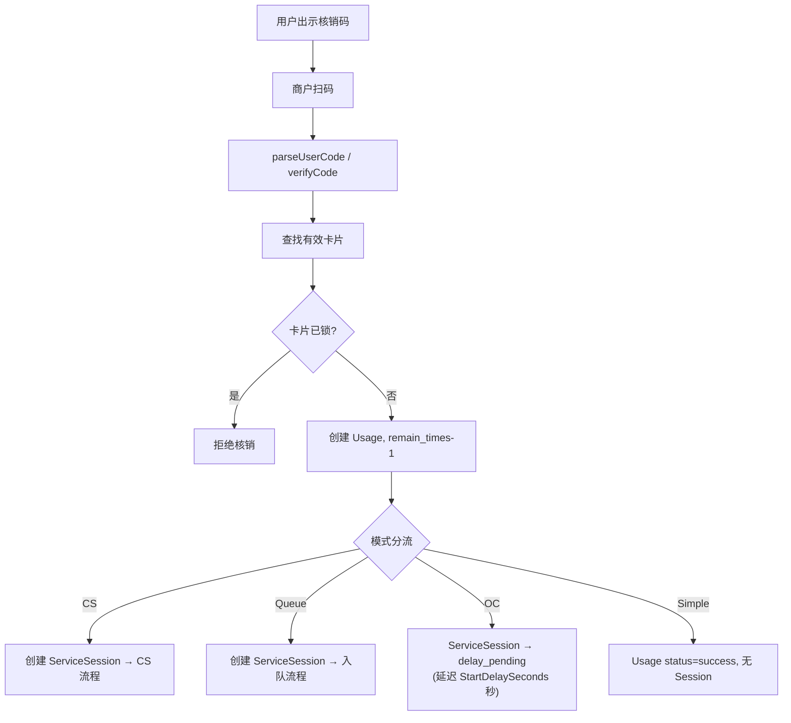

**结单入口**：
- 商户扫码结单：将 `in_progress` Usage → `success` + 关联 session → `finished`
- 加钟：`ExtendServiceSession` → 延长 `duration_minutes` + 重算 `scheduled_finish_at`
- 撤销：`RevokeUsage`（`handlers/usage_revoke.go`）→ 检查未起单 + 超时次数 ≤1 → 回退 remain_times + cancel session

### 3.6 房间管理

**CRUD**：`handlers/room.go` → `ListRooms/CreateRoom/UpdateRoom/DeleteRoom`

**会话集成**：
- CS 模式核销后 → `room_selecting` → 用户选房 `UserChooseRoom`（`service_session_user.go`）
- 自动分房 `assignRoomIfPossible`：查询未被活跃 session 占用的房间
- 房间看板 `TableRooms`（`handlers/table.go`）：列出所有房间 + 关联 session 状态

**超时释放**：scheduler 检测 `room_selecting` 超时 → `canceled` → 释放房间

### 3.7 手牌管理

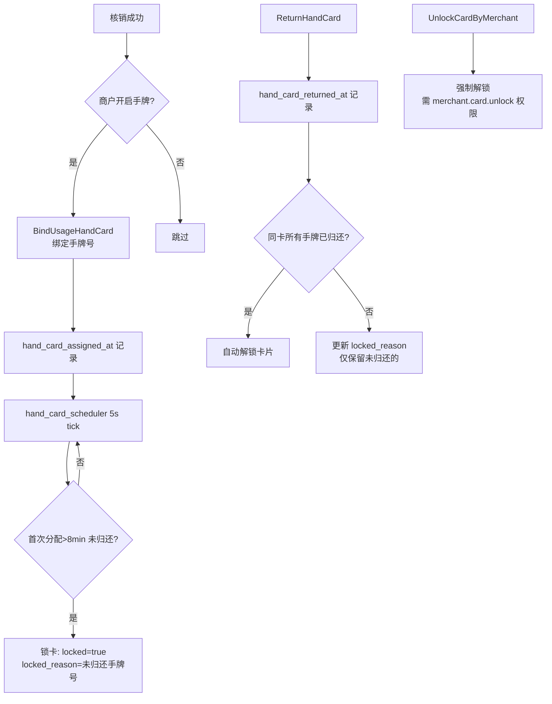

**并发控制**：
- 绑定/归还均使用 `clause.Locking{Strength: "UPDATE"}` 行锁
- 唯一约束 `uidx_usages_merchant_hand_card_active`：同商户同手牌号在"未归还"期间不可重复

### 3.8 直购售卡

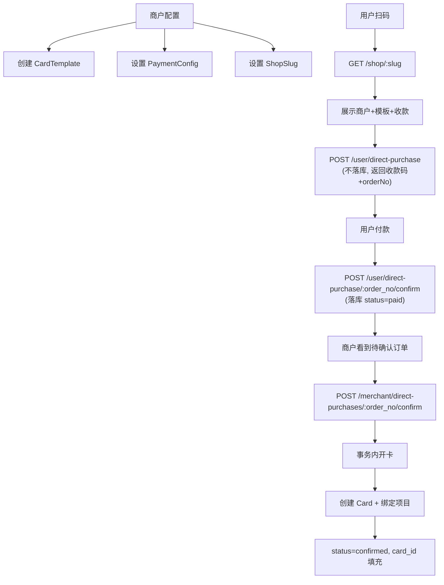

**模板管理**：支持 3 种卡类型（`times`/`balance`/`lesson`），可关联 `MerchantProject`。

### 3.9 技师与考勤

**岗位体系**：
- `ServiceRole`：平台预设（`store_manager`/`front_desk`）+ 商户自定义
- 分类：`operational`（运营岗，3 位编号）/ `professional`（专业岗，4 位编号）
- 商户可通过 `CreateMerchantProfessionalRole`/`CreateMerchantOperationalRole` 自定义岗位

**账号生成**（`handlers/technician.go`）：
- `account = prefix + code`（如 `js0001`）
- `nextTechnicianCodeByPrefix`：事务内 `FOR UPDATE` 取当前最大编号 +1
- 默认密码：`account + "123"`（如 `js0001123`）

**签到策略**（`handlers/attendance_policy.go`）：
- `isRoleAttendanceRequired`：优先查 `MerchantRoleAttendanceConfig` 覆盖 → 回退到 `ServiceRole.RequireAttendance`
- 免签到岗位登录时自动创建 attendance 记录（`ensureAttendanceForNoCheckinRole`）

**技师登录**（`handlers/technician_login.go`）：
- `POST /merchant/staff/login/:slug`：通过店铺 slug 找到商户 → 验证账号密码 → 签发 JWT

**状态切换**（`handlers/technician_attendance.go`）：
- 签到/签退/暂停/恢复
- idle → busy：分配 session 时自动切换
- busy → idle/paused：session 完成后，根据 `NextStatus` 决定
- 自动叫号联动：idle 技师在多窗叫号模式下自动触发 `callNextForTechnician`

---

## 4. 调度与状态流转详细分析

### 4.1 service_session_scheduler（3s tick）

`scheduler/service_session_scheduler.go`，约 500 行，是系统最复杂的调度器。

**处理分支**：

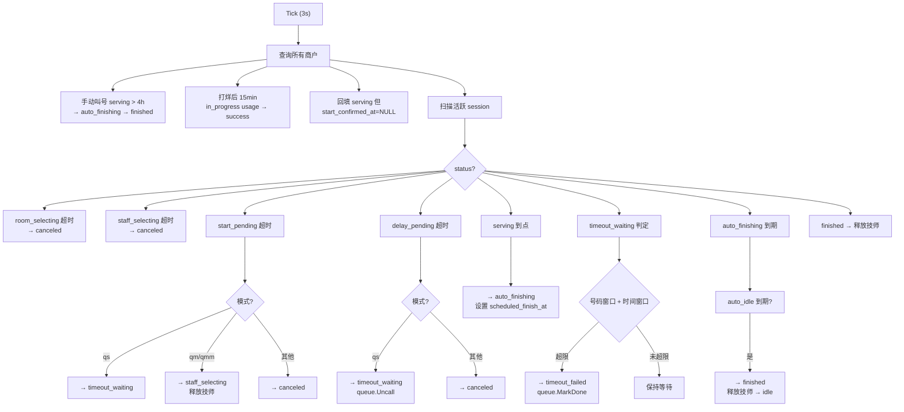

**并发控制**：每个 session 更新使用 `clause.Locking{Strength: "UPDATE"}` 行锁 + 状态条件更新。

### 4.2 appointment_scheduler（15s tick）

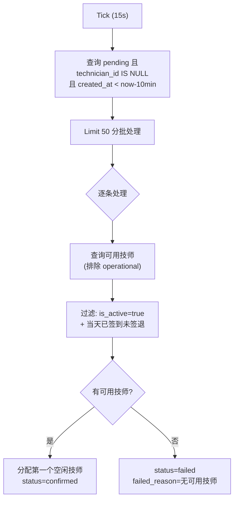

**注意**：当前实现未检查技师同时段是否已有其他预约（见 P1-6）。

### 4.3 hand_card_scheduler（5s tick）

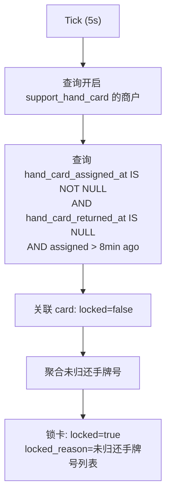

### 4.4 table.go lazyRelease 副作用

`handlers/table.go` 中 `lazyReleaseStartPendingTimeout` 在看板 GET 请求中被调用：

- **触发**：`TableRooms` 和 `TableStaff` handler
- **行为**：扫描当前商户 `start_pending` 且已超时的 session → 释放技师 → `staff_selecting` + `start_timeout_count+1`
- **问题**：
  1. GET 请求含写操作，违反幂等性
  2. 与 `service_session_scheduler` 存在竞争（两者都处理 start_pending 超时）
  3. 手动叫号模式特殊处理：跳过释放（避免手动模式下被自动回退）

### 4.5 调度器交互

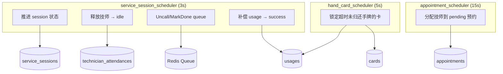

---

## 5. 认证/鉴权/权限体系

### 5.1 用户认证

`middleware/auth.go` 用户分支（第 28-55 行）：

- 格式：`user_{id}_{timestamp}`
- **仅校验**：正则匹配格式 → 提取 user_id → 查库确认用户存在
- **无签名校验**：任何人知道 user_id 即可构造有效 token（**P0-1 漏洞**）

### 5.2 商户/技师 JWT 认证

`middleware/auth.go` 商户/技师分支（第 58-100 行）：

- JWT HS256 签名，签名密钥 `"your-secret-key"` 硬编码（**P0-2 漏洞**）
- Claims 包含：`merchant_id`, `staff_id`(可选), `service_role_id`(可选), `type`("merchant"/"staff")
- token 有效期 7 天

签发入口：
- `handlers/merchant.go`：商户登录
- `handlers/technician_login.go`：技师通过店铺 slug 登录

### 5.3 RBAC 权限体系

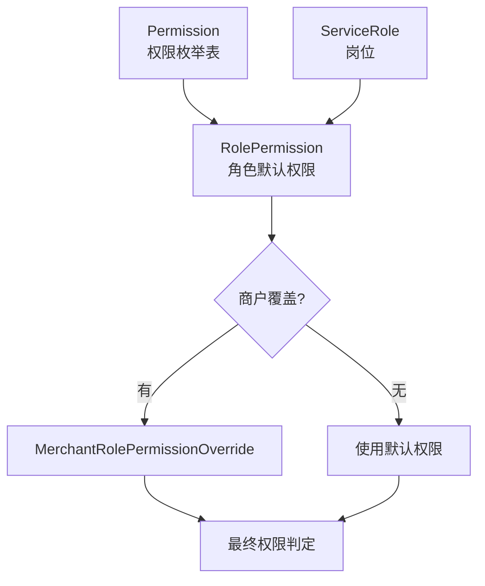

**权限清单**（`config/database.go` initPermissions）：

| Key | 名称 | 分组 |
|---|---|---|
| `merchant.info.manage` | 商户信息设置 | 商户管理 |
| `merchant.service.manage` | 商户服务设置 | 商户管理 |
| `merchant.business_status.manage` | 营业状态管理 | 商户管理 |
| `merchant.notice.manage` | 通知管理 | 通知管理 |
| `merchant.direct_sale.manage` | 售卡管理 | 售卡管理 |
| `merchant.card.issue` | 发卡/开卡 | 卡片管理 |
| `merchant.card.verify` | 核销 | 卡片管理 |
| `merchant.card.verify_finish` | 核销即结单 | 卡片管理 |
| `merchant.card.finish` | 结单 | 卡片管理 |
| `merchant.card.sell` | 售卡 | 卡片管理 |
| `merchant.card.unlock` | 解锁卡片 | 卡片管理 |
| `merchant.cs.manage` | 客服管理 | 客服管理 |
| `merchant.table.view` | 查看看板 | 看板 |
| `merchant.room.view` | 查看房间 | 看板 |
| `merchant.staff.view` | 查看客服 | 看板 |
| `merchant.appointment.view` | 预约查看 | 预约管理 |
| `merchant.appointment.manage` | 预约管理 | 预约管理 |
| `merchant.queue.calling` | 叫号 | 叫号管理 |
| `merchant.permission.adjust` | 权限微调 | 权限管理 |

### 5.4 岗位体系

**平台预设**：
- `store_manager`（店长，前缀 `sm`）：默认几乎全权限
- `front_desk`（前台，前缀 `fd`）：营业/通知/核销/售卡/预约/叫号

**商户自定义**：
- 专业岗位：`CreateMerchantProfessionalRole`（默认权限：核销+结单+售卡）
- 运营岗位：`CreateMerchantOperationalRole`（默认复制前台权限）

---

## 6. 功能正常化评估

### 6.1 各分支闭环状态

| 分支 | 闭环状态 | 说明 |
|---|---|---|
| 客服模式 (CS) | ✅ 可运行 | 核销→选房→选人→起单→服务→结单，全链路闭环；并发控制较完善 |
| 叫号模式 (Queue) | ✅ 可运行 | 4 种子模式均有实现；过号/回补机制完整；但 start_pending 超时释放存在 scheduler 与 table.go 竞争 |
| 结单模式 (OC) | ✅ 可运行 | 延迟起单 → 自动进入 serving；链路简单 |
| 简单模式 (Simple) | ✅ 可运行 | 核销直接 success，无 session 生命周期 |
| 预约 | ⚠️ 有缺陷 | 自动分配无时段冲突检测；auth_type 判断错误；创建允许替他人下单 |
| 手牌 | ✅ 可运行 | 绑定→归还→自动锁卡→解锁，闭环完整；并发控制较好 |
| 直购售卡 | ⚠️ 有缺陷 | 订单号客户端生成不可信；卡号碰撞风险 |
| 认证/RBAC | ❌ 安全缺陷 | 用户 token 可伪造；密钥硬编码；多处 IDOR |
| 看板 | ⚠️ 有副作用 | GET 请求修改数据库状态 |

### 6.2 并发与防串台评估

**已实现的防护**：
- 技师服务互斥：`ChooseServiceSessionTechnician` + `handleQueueModeStartScan` 含 busy 二次校验（查是否存在 serving/auto_finishing 会话）
- 资源行锁：session/usage/attendance 更新使用 `clause.Locking{Strength: "UPDATE"}`
- 条件更新：状态推进使用 `WHERE status IN ?` 确保幂等
- 手牌唯一约束：`uidx_usages_merchant_hand_card_active` 防止同号重复分配
- 模式一致性：`ValidateSessionModeForEntry` + `IsModeConsistentWithStatus` 防止跨模式污染

**存在的风险**：
- `lazyReleaseStartPendingTimeout` 与 scheduler 对同一 session 的竞争更新
- 预约自动分配无时段冲突检测 → 同一技师同一时段可能被分配多个预约
- 删除技师不检查活跃会话 → session 外键悬空

### 6.3 测试覆盖现状

| 文件 | 内容 |
|---|---|
| `handlers/usage_enrich_test.go` | `resolveSessionStartConfirmedAt` 回填逻辑测试 |
| `handlers/queue_status_test.go` | 队列状态相关测试 |
| `handlers/merchant_migration_test.go` | 商户迁移测试 |
| `models/session_mode_test.go` | 模式推导逻辑测试 |

覆盖率较低，核心链路（核销、状态推进、并发分配）无自动化测试。

---

## 7. 关键流程 Code Review（漏洞/Bug 清单）

> 本章采用三类状态：`OPEN`（当前未修复）、`FIXED-VERIFY`（历史已修复但需防回归）、`DESIGN-DEBT`（设计债务/待决策）。

### 7.1 OPEN：当前仍存在的问题（按优先级）

#### P0（立即修复）

| ID | 问题 | 代码证据 | 风险 |
|---|---|---|---|
| P0-1 | 用户 token 无签名校验 | `middleware/auth.go` 兼容 `user_{id}_{ts}` 仅做格式+查库校验；`handlers/user.go` 仍签发该格式 token | 可伪造任意用户身份 |
| P0-2 | JWT/HMAC 硬编码密钥 | `middleware/auth.go`、`handlers/user.go` 仍使用 `"your-secret-key"` | 密钥泄露后可伪造 token / user code |
| P0-3 | 用户侧 IDOR（卡/核销/预约） | `GetCard` 未校验 `card.user_id`；`GetCardUsages` 未校验卡归属；`GetUserAppointments` 直接信任 path `:id` | 登录用户可读他人业务数据 |
| P0-4 | 预约创建可替他人下单 | `CreateAppointment` 请求体仍要求 `user_id` 并以此写入 | 越权创建预约 |
| P0-5 | 通知 CRUD 无商户归属校验 | `CreateNotice` 接收 body `merchant_id`；`DeleteNotice`/`TogglePinNotice` 仅按 notice id 处理 | 可跨商户改删通知 |

#### P1（本周修复）

| ID | 问题 | 代码证据 | 风险 |
|---|---|---|---|
| P1-1 | 技师鉴权分支字符串错误 | `GetMerchantAppointments` 判断 `auth_type == "technician"`，而中间件写入为 `"staff"` | 技师预约可见范围控制失效 |
| P1-2 | 商户侧租户边界不收敛 | 多个接口以路径 `:id` 作为 merchant_id 查询，未统一校验 token merchant_id | 跨商户读取面 |
| P1-3 | 看板 GET 含写副作用 | `TableRooms`/`TableStaff` 会调用 `lazyReleaseStartPendingTimeout` 写库 | 幂等性破坏 + 与 scheduler 竞争更新 |
| P1-4 | 删除技师未校验活跃会话 | `DeleteMerchantTechnician` 直接 delete | 活跃会话关联悬空 |
| P1-5 | 技师列表接口 N+1 | `GetTechniciansByMerchantID` 按技师逐条查 override/rolePerm | 技师规模增长后性能劣化 |
| P1-7 | 解锁卡未限制 locked=true | `UnlockCardByMerchant` 更新条件仅 `id + merchant_id` | 非锁卡也可被“解锁”，导致审计字段污染 |

#### P2（迭代修复）

| ID | 问题 | 代码证据 | 风险 |
|---|---|---|---|
| P2-1 | 内部队列快照可匿名 | `KABAO_INTERNAL_TOKEN` 未配置时不做鉴权 | 队列数据泄露 |
| P2-2 | 订单号客户端生成且未落库 | `CreateDirectPurchase` 生成 orderNo 直接返回；`ConfirmDirectPurchase` 才首次落库 | 订单标识可被构造/复用 |
| P2-3 | 卡号短 UUID 碰撞风险 | `MerchantConfirmDirectPurchase` 使用 `uuid[:8]` 作为 card_no | 高并发下碰撞风险 |
| P2-4 | 默认密码可预测 | `CreateMerchantTechnician` 默认密码 = `account + "123"` | 弱口令风险 |
| P2-5 | 登录无速率限制 | 用户/商户/技师登录均无限流 | 暴力破解风险 |
| P2-6 | SMS debug 泄露验证码 | 非 release 模式返回验证码明文 | 测试环境验证码泄露 |
| P2-7 | `autoFixUsages` 读接口写副作用 | `GetCardUsages`/`GetMerchantUsages` 调用 `autoFixUsages` 写库 | 与 P1-3 同类幂等性问题 |
| P2-8 | 启动时内联 DDL 迁移 | `InitDB()` 内大量 `DB.Exec(ALTER/CREATE ...)` | 无版本化、无回滚、发布风险高 |

### 7.2 FIXED-VERIFY：历史高风险问题已修复（需持续回归）

结合 `docs/history/plans/1-8` 与当前代码复核，以下问题当前实现已具备修复痕迹，但必须纳入回归测试防止回退：

| 历史ID | 结论 | 当前代码信号 |
|---|---|---|
| F1/F2/F7/F8/F15 | `ServiceSession` 裸状态写入/裸 `WHERE status =` 导致卡死 | 当前关键路径普遍使用 `ApplyStatusPrefix` + `ExpandStatus(es)WithKnownPrefixes` |
| F3/F4/F5/F6/F10/F11/F12/F13/F14 | handler 中裸状态比较/写入问题 | 当前关键判断普遍改为 `NormalizeSessionStatus`，撤销/迁移分支改为前缀兼容 |
| E1 | 过号窗口公式 | `QsTimeoutWindowEndNo()` 当前为 `myNo + 3`（固定3号窗口） |

**回归建议（必须常驻）**：
1. cs_ 链路：`delay_pending -> serving -> auto_finishing -> finished` 完整推进。
2. qm_/qmm_：`start_pending` 超时取消与技师释放。
3. 用户撤销：`serving/auto_finishing/finished` 必须拒绝撤销。
4. qs_ 过号：`myNo=10` 时 `currentNo=11/12/13` 可回补，`>=14` 失败。

### 7.3 DESIGN-DEBT：设计债务 / 待决策项

| 项目 | 现状 | 建议 |
|---|---|---|
| 模式防串用守卫 | 缺少入口级 `session_mode` 与流程匹配强校验 | 在入口和状态推进处增加模式一致性守卫 |
| 客服子模式细分（暂不做） | `ResolveSessionMode` 统一返回 `cs`，未细分 `cs_order/cs_full` | 当前版本不做手动结单需求开发，暂不推进子模式拆分；若未来引入手动结单/多客服并行差异化，再重新评估 |
| 状态迁移审计 | 缺少集中 transition 审计日志 | 抽象统一 transition 层，记录前后状态与操作者 |

---

## 8. 修复计划实施方案

> 本章与第7章同构：按 `OPEN / FIXED-VERIFY / DESIGN-DEBT` 给出实施方案，并保留建议时效与验收点。

### 8.1 OPEN：当前仍存在问题的实施计划

#### 8.1.1 P0 OPEN（立即修复）

| ID | 修复动作 | 具体方案 | 影响文件/模块 | 建议时效 | 验收点 |
|---|---|---|---|---|---|
| P0-1 | 用户 token 改为强签名 JWT | 新增 `KABAO_USER_JWT_SECRET`；`generateToken` 改 JWT（含 `user_id/exp/iss`）；`AuthMiddleware` 用户分支改 JWT 校验；保留 legacy token 窗口后移除 | `handlers/user.go`, `middleware/auth.go`, `config/env.go` | 24h | 伪造 `user_{id}_{ts}` 无法访问；合法 JWT 可用 |
| P0-2 | 移除硬编码密钥 | 外置 `KABAO_JWT_SECRET`、`KABAO_USER_CODE_SECRET`；替换全部 `"your-secret-key"` | `middleware/auth.go`, `handlers/merchant.go`, `handlers/technician_login.go`, `handlers/user.go`, `config/env.go` | 24h | 未配置密钥时服务拒绝启动；签发/验签一致 |
| P0-3 | 修复用户侧 IDOR | 用户接口统一追加资源归属校验：`card.user_id == current_user_id`、`appointment.user_id == current_user_id` | `handlers/card.go`, `handlers/usage.go`, `handlers/appointment.go` | 24h | 用 A 用户 token 访问 B 用户资源返回 403 |
| P0-4 | 预约创建绑定登录态用户 | `CreateAppointment` 删除 body `user_id` 输入，统一使用 `c.Get("user_id")` | `handlers/appointment.go` | 24h | 请求体篡改 `user_id` 不再生效 |
| P0-5 | 通知操作绑定商户归属 | `CreateNotice` 强制取 token merchant_id；删除/置顶按 `id + merchant_id` 条件更新 | `handlers/notice.go` | 24h | 跨商户 notice 变更返回 403/404 |

#### 8.1.2 P1 OPEN（本周修复）

| ID | 修复动作 | 具体方案 | 影响文件/模块 | 建议时效 | 验收点 |
|---|---|---|---|---|---|
| P1-1 | 修复 staff 分支判断 | `GetMerchantAppointments` 中 `"technician"` 改 `"staff"`，并补单测 | `handlers/appointment.go` | 3-5天 | staff 仅可见分配给自己的预约（无管理权限时） |
| P1-2 | 统一商户租户边界 | 落地 `ensureMerchantScope`（或内联校验）强制 `pathMerchantID == tokenMerchantID` | `routes`, `handlers/*merchant scoped*` | 3-5天 | 任一路径 merchant_id 篡改均被拒绝 |
| P1-3 | 去除看板 GET 写副作用 | `lazyReleaseStartPendingTimeout` 迁移到 `service_session_scheduler`；看板 handler 纯读 | `handlers/table.go`, `scheduler/service_session_scheduler.go` | 3-5天 | 连续 GET 不再触发 DB 状态写入 |
| P1-4 | 删除技师前活跃会话校验 | 删除前检查活跃 `ServiceSession`；存在则拒绝删除并给出明确错误 | `handlers/technician.go` | 3-5天 | 活跃会话技师删除请求返回 400 |
| P1-5 | 消除技师列表 N+1 | 批量预取 `MerchantRolePermissionOverride` 与 `RolePermission`，内存判定 | `handlers/technician.go` | 1-2周 | 技师列表 SQL 查询数随人数不线性增长 |
| P1-7 | 解锁卡增加条件更新 | `UnlockCardByMerchant` 增加 `WHERE locked = true`（幂等） | `handlers/hand_card.go` | 3-5天 | 未锁卡执行解锁不再污染审计字段 |

#### 8.1.3 P2 OPEN（迭代修复）

| ID | 修复动作 | 具体方案 | 影响文件/模块 | 建议时效 | 验收点 |
|---|---|---|---|---|---|
| P2-1 | 内部队列接口强制鉴权 | 生产环境启动校验 `KABAO_INTERNAL_TOKEN` 必填 | `handlers/internal_queue.go`, `config/env.go` | 3-5天 | 未携带 token 统一 401 |
| P2-2 | 订单号改服务端可信生成 | `CreateDirectPurchase` 创建 pending 订单落库并返回 `order_no`；`Confirm` 仅接受已存在订单 | `handlers/shop.go`, `models/direct_purchase.go` | 1-2周 | 客户端自造 order_no 无法确认 |
| P2-3 | 卡号生成去碰撞方案 | 采用商户维度递增序号（可含校验位）替代 `uuid[:8]` | `handlers/shop.go`, `models/card.go` | 1-2周 | 压测无重复 card_no |
| P2-4 | 默认密码策略升级 | 创建技师改随机临时密码（一次性回显），首次登录强制改密 | `handlers/technician.go`, `handlers/technician_login.go` | 1-2周 | 默认口令不可预测且不可长期复用 |
| P2-5 | 登录限流 | 按 IP + 账号维度限流（如 Redis counter） | `handlers/user.go`, `handlers/merchant.go`, `handlers/technician_login.go`, `middleware` | 1-2周 | 达阈值后返回 429 |
| P2-6 | SMS debug 输出治理 | 引入 `KABAO_SMS_DEBUG`，与 `gin mode` 解耦，默认不回传验证码 | `handlers/sms.go`, `config/env.go` | 1-2周 | 非显式 debug 配置不返回验证码 |
| P2-7 | 读副作用治理 | 将 `autoFixUsages` 下沉 scheduler，`Get*Usages` 纯读 | `handlers/usage.go`, `scheduler` | 1-2周 | GET 查询不再产生写操作 |
| P2-8 | DB 迁移版本化 | 引入 migrate 工具，拆分 `InitDB` 内联 DDL 为版本文件 | `config/database.go`, `migrations/` | 2-4周 | 发布不再执行全量 DDL；支持回滚 |

### 8.2 FIXED-VERIFY：已修复项的回归守护计划

| 历史ID | 守护目标 | 回归用例 | 触发入口 | 守护频率 |
|---|---|---|---|---|
| F1/F2/F7/F8/F15 | 防止裸状态写入/查询回归 | 校验状态推进与 `WHERE status` 全部走前缀兼容工具 | `handlers/service_session.go`, `scheduler/service_session_scheduler.go`, `handlers/usage_revoke.go` | 每次状态机改动必跑 |
| F3/F4/F5/F6/F10/F11/F12/F13/F14 | 防止裸状态比较回归 | 关键判断统一走 `NormalizeSessionStatus`，覆盖撤销/迁移分支 | `handlers/service_session.go`, `handlers/usage_revoke.go` | 每次相关 PR 必跑 |
| E1 | 过号窗口保持 3 号规则 | `myNo=10` 时 `11/12/13` 可回补，`>=14` 失败 | `models/session_mode.go`, `handlers/queue_status.go` | 每次叫号规则改动必跑 |
| P1-6 | 预约冲突检测防回退 | 同时段 `pending/confirmed` 冲突下禁止重复分配同技师 | `scheduler/appointment_scheduler.go` | 每次排班逻辑改动必跑 |

### 8.3 DESIGN-DEBT：设计债务治理路线

| 债务项 | 当前约束 | 治理方案 | 前置决策 | 预计周期 |
|---|---|---|---|---|
| 模式防串守卫 | 入口层缺少统一 `session_mode` 强校验 | 在关键入口 + 状态推进点新增模式一致性守卫与错误码 | 保持现有单状态机不变 | 2-4周 |
| 客服子模式细分（暂不做） | 目前统一 `cs`，缺少 `cs_order/cs_full` 明确分叉 | 当前版本不引入手动结单，因此不推进子模式拆分；未来如新增手动结单/多客服差异流程，再补齐子模式与迁移兼容 | 需要先引入手动结单需求并明确流程边界 | 暂不排期 |
| 状态迁移审计 | transition 记录分散，追责与回放成本高 | 建立统一 transition 记录（前状态/后状态/操作者/入口） | 明确日志保留策略与隐私边界 | 2-4周 |

---

## 9. Wiki 持续维护规范

1. **状态机变更**：每次改动 `ServiceSession` 状态或调度规则，必须同步更新本文件第 2.2 节状态图与第 4 节调度章节
2. **新增接口**：必须标注鉴权方式（无/User JWT/Merchant JWT/Admin/Internal Token）、租户边界校验方式、影响的状态
3. **权限变更**：修改 `initPermissions`/`initRolePermissions` 时同步更新第 5.3 节权限清单
4. **PR 检查项**：模板中增加：
   - [ ] 是否影响状态机/权限边界？若是，Wiki 是否同步更新？
   - [ ] 新接口是否有 IDOR 风险？是否校验资源归属？
   - [ ] 是否在 GET handler 中引入了写操作？
5. **版本标识**：Wiki 文件名包含 commit 短 ID，确保可追溯
